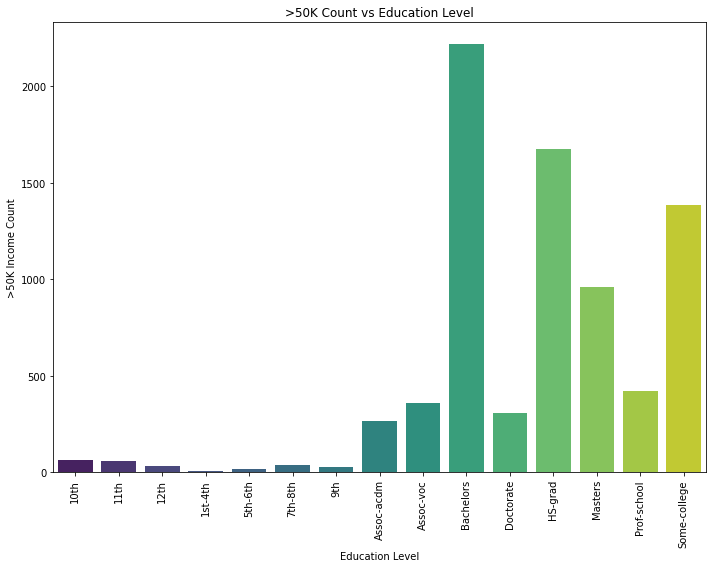
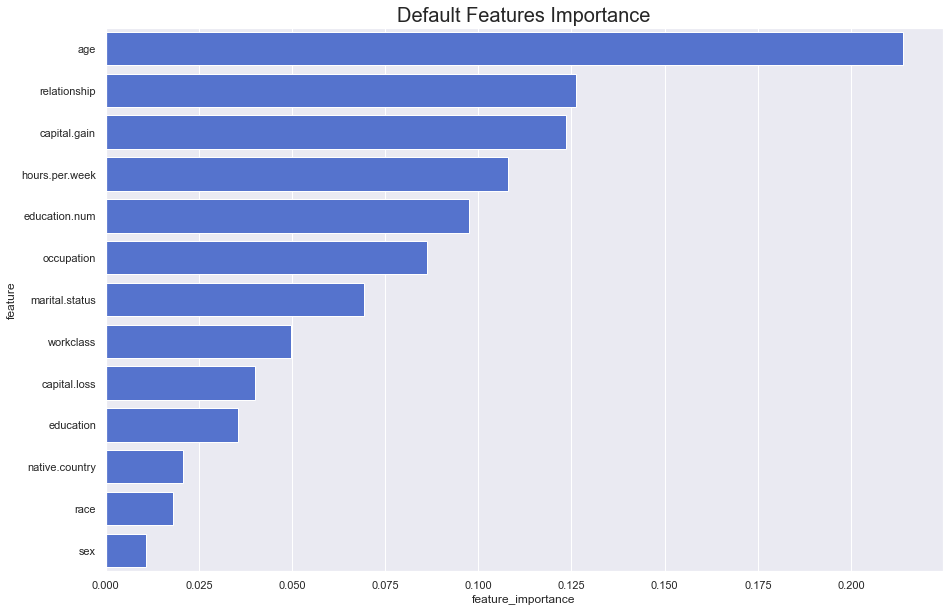
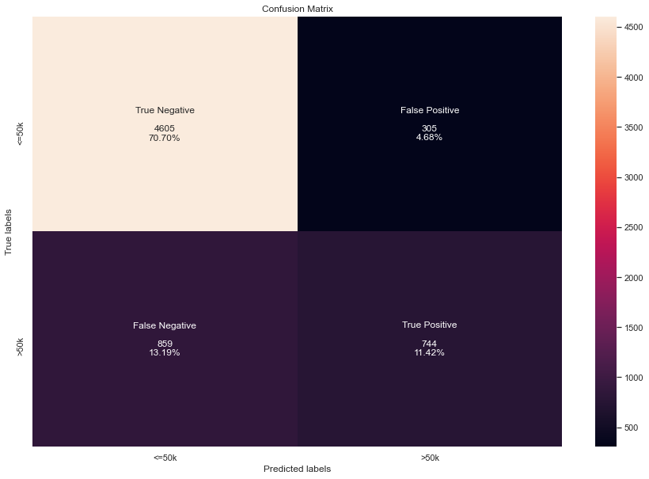
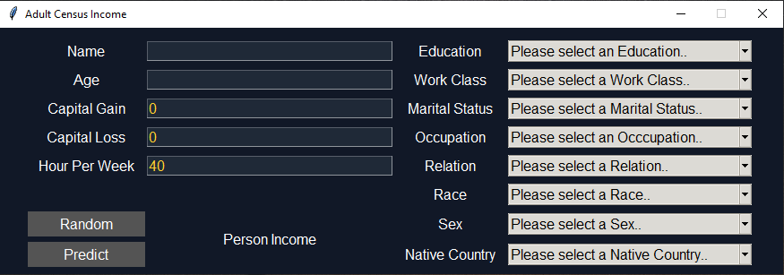
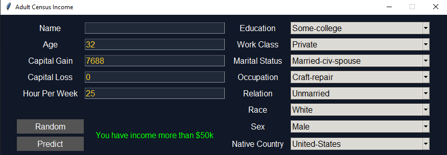
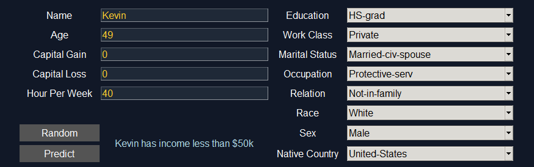

# Adult Census Income

using dataset from [kaggle](https://www.kaggle.com/uciml/adult-census-income)  
GaussianNB model **accuracy = 82.13 %**


## About Dataset

This data was extracted from the 1994 Census bureau database by Ronny Kohavi and Barry Becker (Data Mining and Visualization, Silicon Graphics). A set of reasonably clean records was extracted using the following conditions: ((AAGE>16) && (AGI>100) && (AFNLWGT>1) && (HRSWK>0)). The prediction task is to determine whether a person makes over $50K a year.  


## Description of fnlwgt (final weight)

The weights on the Current Population Survey (CPS) files are controlled to independent estimates of the civilian noninstitutional population of the US. These are prepared monthly for us by Population Division here at the Census Bureau. We use 3 sets of controls.  

1. A single cell estimate of the population 16+ for each state.
2. Controls for Hispanic Origin by age and sex.
3. Controls by Race, age and sex.

We use all three sets of controls in our weighting program and "rake" through them 6 times so that by the end we come back to all the controls we used. The term estimate refers to population totals derived from CPS by creating "weighted tallies" of any specified socio-economic characteristics of the population. People with similar demographic characteristics should have similar weights. There is one important caveat to remember about this statement. That is that since the CPS sample is actually a collection of 51 state samples, each with its own probability of selection, the statement only applies within state.  



## Feature Importance

Let's start with decision trees to build some intuition. In decision trees, every node is a condition how to split values in a single feature, so that similar values of dependent variable end up in the same set after the split. The condition is based on impurity, which in case of classification problems is Gini impurity / information gain (entropy), while for regression trees its variance. So when training a tree we can compute how much each feature contributes to decreasing the weighted impurity. **feature_importances_** in Scikit-Learn is based on that logic, but in case of Random Forest we are talking about averaging the decrease in impurity over trees.



## Evaluation




## Usage

```sh
>> py main.py
```  



- press **random** to generate random data
- press **predict** to make a prediction from user input

## Example

- has income more than 50k  


</br>

- has income less than 50k  

