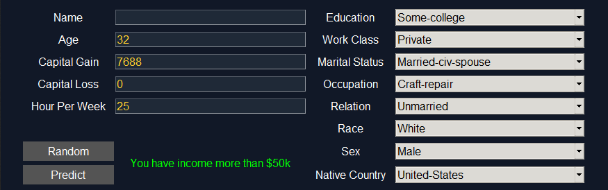

# Adult Census Income

using dataset from [kaggle](https://www.kaggle.com/uciml/adult-census-income)  
GaussianNB model accuracy = 82.40 %


## Usage

```sh
>> py main.py
```


- press **random** to generate random data
- press **predict** to make a prediction from user input

## Example

- has income more than 50k


</br>

- has income less than 50k

